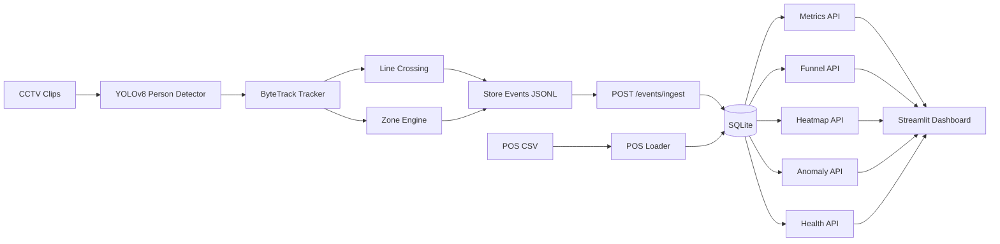

# Design

## 1. Problem Definition

The challenge is not only to detect people in CCTV. The useful product is a reliable event stream that explains store behavior: who entered, where they spent time, whether they reached billing, whether they purchased, and whether operations are degrading.

The design separates video interpretation from business analytics. The detection pipeline emits typed events. The API stores those events and computes metrics from persisted facts.

## 2. Architecture Diagram

## 3. Component Breakdown

- `pipeline.detector`: lazy YOLOv8 person detector.
- `pipeline.tracker`: ByteTrack adapter and deterministic test tracker.
- `pipeline.line_crossing`: entry and exit crossing logic.
- `pipeline.zones`: calibrated polygon zones and dwell transitions.
- `pipeline.event_builder`: challenge-schema event creation.
- `app.models`: Pydantic request and response contracts.
- `app.repository`: SQLite persistence, derived queue visits, zone visits, and POS attribution.
- `app.metrics`, `app.funnel`, `app.heatmap`, `app.anomalies`: analytics services.
- `dashboard.streamlit_app`: reviewer-facing dashboard backed by public APIs.

## 4. Data Flow

1. A CCTV clip is read by OpenCV.
2. YOLOv8 detects people.
3. ByteTrack assigns stable track IDs within a clip/camera.
4. Foot-point movement across an entry line emits `ENTRY` or `EXIT`.
5. Foot-point containment inside configured polygons emits zone events.
6. `CASH_COUNTER` zone transitions derive queue joins and exits.
7. Events are written as JSONL or posted to `/events/ingest`.
8. SQLite stores raw events and derived visit tables.
9. POS rows are loaded separately and attributed to visitor sessions.
10. APIs compute metrics, funnel, heatmap, anomalies, and health.

## 5. Detection Pipeline

The production path uses `YoloPersonDetector` with the YOLOv8 nano model. It filters to person class `0`, applies confidence and IoU thresholds, and runs on CPU for portable Docker execution.

Tracking uses Ultralytics ByteTrack via `model.track(..., tracker="bytetrack.yaml")`. The adapter converts tracker boxes into internal `TrackObservation` objects. The rest of the system does not depend on Ultralytics-specific output.

Entry/exit depends on a calibrated line. Zone analytics depend on calibrated polygons from `data/zone_config.json`. These calibration inputs are explicit because they are easier to audit than hidden model behavior.

## 6. Event Model

Each event contains:

- `event_id`
- `store_id`
- `camera_id`
- `visitor_id`
- `event_type`
- UTC `timestamp`
- optional `zone_id`
- `dwell_ms`
- `is_staff`
- detection `confidence`
- metadata such as `session_seq`, `sku_zone`, `queue_depth`, and source details

The ingest API validates each event independently. Duplicate `event_id`s are ignored. Malformed events are returned as structured errors without rejecting the entire batch.

## 7. Analytics Layer

Analytics are computed from persisted events:

- Metrics count non-staff visitors, conversion, dwell, queue depth, wait time, and abandonment.
- Funnel enforces `ENTRY -> ZONE_VISIT -> CASH_COUNTER -> PURCHASE`.
- Heatmap ranks zones using visit volume and dwell time.
- Anomalies detect high dwell, queue congestion, traffic spikes, re-entry spikes, low conversion, and unmatched POS transactions.

POS attribution creates purchase events from nearest non-staff sessions within a configurable window. This keeps conversion metrics tied to visitor behavior without requiring POS rows to contain CCTV IDs.

## 8. API Layer

Required endpoints:

- `POST /events/ingest`
- `GET /stores/{store_id}/metrics`
- `GET /stores/{store_id}/funnel`
- `GET /stores/{store_id}/heatmap`
- `GET /stores/{store_id}/anomalies`
- `GET /health`

Additional endpoint:

- `GET /stores/{store_id}/dashboard`

Routers are thin. They delegate to service classes and repository methods so SQL and business logic do not live in request handlers.

## 9. Dashboard Layer

The dashboard uses Streamlit and calls the public API. It does not read SQLite directly and does not render mock metrics. It shows metric cards, trends, funnel, zone dwell, queue analytics, top zones, anomalies, and feed health.

## 10. Storage Design

SQLite tables:

- `events`: immutable event stream.
- `ingest_batches`: accepted, duplicate, and rejected counts.
- `pos_transactions`: normalized POS rows.
- `purchase_attributions`: POS-to-visitor matches.
- `queue_visits`: derived queue sessions.
- `zone_visits`: derived zone sessions.

Indexes cover store/time, event type, visitor lookup, zone lookup, POS lookup, queue visits, and zone visits.

SQLite was chosen for reviewer reproducibility and zero external setup. The schema is still production-shaped: append-only events plus derived operational tables.

## 11. Scalability Considerations

The system scales by separating concerns:

- Video processing can run outside the API and replay events later.
- API analytics are isolated from detection code.
- Event storage can move from SQLite to PostgreSQL with minimal API changes.
- High-volume deployments can materialize hourly aggregates.
- Queue/POS/zone projections can be recomputed from raw events.

## 12. Failure Modes

- Invalid event payloads: rejected per event with error details.
- Duplicate events: ignored through `event_id`.
- Missing video file: pipeline fails fast.
- Invalid zone config: pipeline fails before tracking.
- Database unavailable: API returns structured `503`.
- Stale event feed: `/health` reports `DEGRADED`.
- Ambiguous POS attribution: nearest-session confidence is recorded.
- Occlusion or missed detections: ByteTrack and conservative session matching reduce but do not eliminate errors.

## 13. Monitoring and Observability

The API logs request path, status code, latency, trace ID, store ID when available, and approximate ingest count. `/health` reports database state and store feed freshness.

Useful production extensions would be OpenTelemetry traces, structured log export, detector throughput metrics, per-camera frame failure counts, and anomaly alert routing.

## 14. Security Considerations

This challenge build is local and unauthenticated. In production, ingestion should require authentication, source authorization, payload signing or replay protection, request-size limits, and dashboard access control. CCTV-derived visitor data should be retained only as events, not raw identity features.

## 15. Future Improvements

- Add historical time-window query parameters.
- Add staff classification from visual or schedule signals.
- Add a floor-plan heatmap overlay.
- Add calibrated entry lines per camera through config.
- Move storage to PostgreSQL.
- Add async ingestion with durable queues.
- Add OpenTelemetry and alert delivery.
- Add measured cross-camera re-identification only if false merges stay low.
