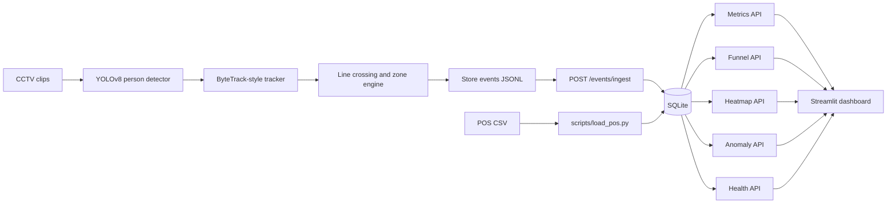
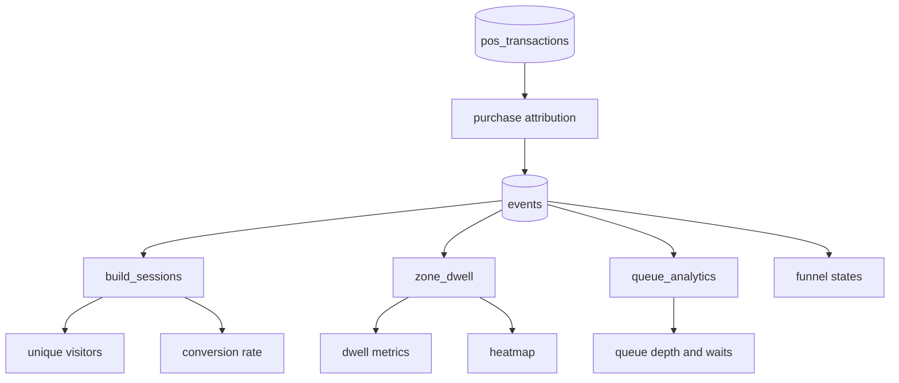

# Store Intelligence Design

## Problem Understanding

The challenge asks for a production-aware store intelligence system, not just a video demo. The important contract is a reliable event stream: once CCTV is converted into `ENTRY`, `EXIT`, `REENTRY`, zone, queue, and purchase events, the API can compute metrics, funnel, heatmap, anomalies, and dashboard views in a testable way.

The implementation therefore separates video interpretation from business analytics. The detector can improve later without changing the API, and analytics rules can evolve without retraining the detector.

## Architecture

Primary packages:

- `pipeline/`: detection, tracking, re-entry, line crossing, zone transitions, event generation.
- `app/`: FastAPI app, validation, repository, analytics, attribution, logging, errors.
- `dashboard/`: Streamlit UI that reads only public APIs.
- `scripts/`: replay utility and POS loader.
- `tests/`: API, analytics, pipeline, and loader coverage.

## Detection Layer

The production path uses YOLOv8 for person detection through `pipeline.detector.YoloPersonDetector`. `pipeline.tracker.UltralyticsByteTrackAdapter` calls Ultralytics tracking with `tracker="bytetrack.yaml"` and converts model output into internal `TrackObservation` objects.

The repo also includes `SimpleByteTrackAdapter`, a deterministic IoU tracker used by tests. This keeps the scoring-critical tracking logic covered without requiring GPU, model weights, or video files in CI.

## Tracking Layer

`EventTracker` keeps per-track state and emits visitor events from observations. It uses:

- `EntryExitLine` for inbound/outbound crossing.
- `VisitorIdManager` for conservative re-entry matching.
- `ZoneEngine` for zone containment and dwell transitions.
- `EventBuilder` for consistent schema output.

Group entry is handled per track. Re-entry is treated as visit-session continuity, not biometric identity. Staff status is preserved on events and excluded from customer metrics downstream.

## Event Layer

Events use a typed schema with:

- stable `event_id`
- `store_id`, `camera_id`, `visitor_id`
- `event_type`
- UTC `timestamp`
- optional `zone_id`
- `dwell_ms`
- `is_staff`
- detector `confidence`
- small metadata for queue depth, SKU zone, session sequence, and source details

`POST /events/ingest` validates each event independently. Valid events are inserted, duplicate `event_id`s are ignored, and invalid records are returned as structured batch errors. One malformed event does not poison the whole batch.

## Storage Layer

SQLite is used for reproducible challenge execution. Tables include:

- `events`
- `ingest_batches`
- `pos_transactions`
- `purchase_attributions`
- `queue_visits`
- `zone_visits`

Indexes cover store/time queries, event type, visitor, zone lookups, queue state, and POS lookup. The event stream remains the source of truth; derived visit tables provide auditable operational facts.

## Analytics Layer

Metrics compute unique visitors, conversion rate, average/median/max dwell by zone, queue depth, wait time, and abandonment rate from persisted data.

Funnel stages are session-based: `ENTRY -> ZONE_VISIT -> CASH_COUNTER -> PURCHASE`. Staff is excluded and stages are sequential.

Heatmap uses zone visit count and dwell to produce a bounded heat score. Average dwell is per visit, not per unique visitor.

Anomalies are auditable rules over stored facts: high dwell, queue congestion, traffic spike, re-entry spike, low conversion, and POS mismatch.

## API Layer

Required endpoints:

- `POST /events/ingest`
- `GET /stores/{store_id}/metrics`
- `GET /stores/{store_id}/funnel`
- `GET /stores/{store_id}/heatmap`
- `GET /stores/{store_id}/anomalies`
- `GET /health`

Additional dashboard endpoint:

- `GET /stores/{store_id}/dashboard`

Routers stay thin and delegate to service modules. Repository methods isolate SQL from request handlers.

## Dashboard

The Streamlit dashboard renders live metrics, trends, funnel, zone dwell, queue analytics, top zones, anomaly visibility, and feed health. It does not read SQLite directly and does not render mock data. Empty stores show empty states.

## Observability

The API configures request logging middleware with:

- trace ID from `x-trace-id` or generated UUID
- endpoint path
- store ID when available
- latency in milliseconds
- status code
- approximate ingest event count

Errors are returned as structured JSON with a code and trace ID. `/health` reports database availability, latest event timestamp per store, stale-feed state, and overall `DEGRADED` status when any feed is stale.

## Tradeoffs

SQLite was chosen over PostgreSQL to minimize setup friction while preserving real persistence and SQL semantics. A message queue was rejected because the evaluation workload is finite and synchronous computation is easier to validate. Heavy cross-camera re-identification was rejected because false visitor merges are more damaging than conservative missed matches for this challenge.

The implementation is production-shaped but not overbuilt. The path to scale is clear: move storage to PostgreSQL, put ingestion behind a durable queue, and materialize analytics projections when event volume requires it.

## Failure Handling

- Invalid event payloads are rejected per record.
- Duplicate event IDs are idempotent.
- Database failures return `503` structured errors.
- Missing zone config or invalid polygons fail fast before tracking.
- POS rows with invalid timestamps, negative amounts, unknown stores, or duplicates are reported by the loader.
- Dashboard API failures are visible in the UI.

## Scalability

Queries are scoped by store and time window for normal metrics. Tables are append-oriented and indexed for store/time access. The detector, tracker, event schema, API, and dashboard are separated so individual layers can be replaced without rewriting the whole system.

## Future Improvements

- Add a real staff classifier connected to the existing `is_staff` field.
- Add calibrated camera-specific entry lines for all clips.
- Persist materialized hourly aggregates for high-volume deployments.
- Add authenticated ingestion for production use.
- Add OpenTelemetry export for logs and traces.
- Add richer dashboard filtering by time window and camera.

## AI Usage

AI assistance was used to identify likely scoring blind spots, especially duplicate ingest, empty stores, staff exclusion, re-entry, zone dwell, queue analytics, purchase attribution, and dashboard empty states. Suggestions that added unnecessary complexity, such as a queue-first architecture or heavyweight re-identification, were intentionally rejected. The final design favors small typed contracts, deterministic analytics, and tests over speculative infrastructure.
